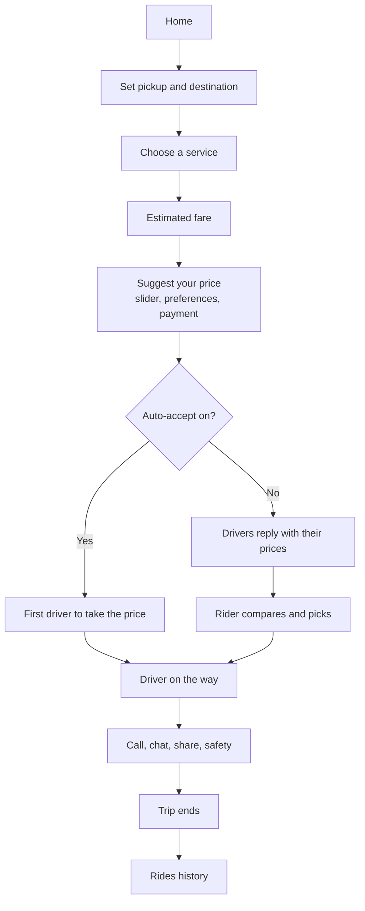
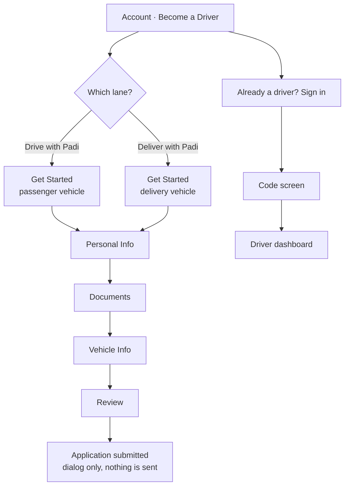
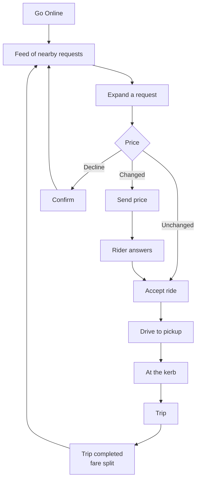
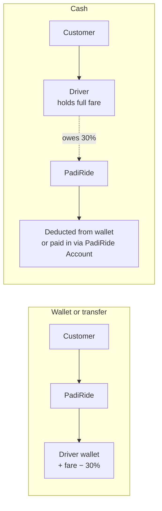

# PadiRide

A ride-hailing and delivery app for Aba, Abia State, Nigeria, built with React Native and Expo. Its distinguishing idea is **negotiated pricing**: the app quotes an estimate, the rider counters with what they are actually willing to pay, and nearby drivers accept that price, send back their own, or decline.

<div align="center">


</div>

---

## Project status

> **This is a front-end prototype. There is no backend.**
>
> Every screen is built, navigable and interactive, but the app makes **no network requests**. There is no server, no database, no authentication service, no payment provider, no dispatch system, no GPS, no bank payout processing and no push infrastructure.
>
> Everything the app displays comes from seeded data files that ship inside the bundle. Anything you change while using it lives in memory and is gone on restart.
>
> This is a deliberate stage of the build. The data modules are shaped like the responses a service would return, so connecting a backend later is a change of source rather than a rewrite of screens.

What that leaves is still substantial: 85 screens with working navigation, form validation, filtering, sorting, bottom sheets, countdown timers, empty states, and complete prototype flows on both the rider and driver sides. See [Implementation status](#implementation-status) for a line-by-line breakdown.

---

## Table of contents

- [What PadiRide is](#what-padiride-is)
- [The problem](#the-problem)
- [The core idea](#the-core-idea)
- [Ride services](#ride-services)
- [Rider experience](#rider-experience)
- [Driver and delivery partner experience](#driver-and-delivery-partner-experience)
- [Driver money model](#driver-money-model)
- [Key features](#key-features)
- [Screens](#screens)
- [User flows](#user-flows)
- [Implementation status](#implementation-status)
- [Tech stack](#tech-stack)
- [Getting started](#getting-started)
- [Project structure](#project-structure)
- [Architecture](#architecture)
- [Known limitations](#known-limitations)
- [Roadmap](#roadmap)
- [License](#license)

---

## What PadiRide is

PadiRide is a mobile app with two sides in one codebase:

- **Riders** book cars, tricycles, motorbikes and parcel deliveries around Aba.
- **Drivers and delivery partners** apply, sign in, go online, work requests, and manage their money and paperwork.

A rider can apply to drive or deliver without leaving the app, and an existing driver signs in through a door at the foot of that same flow.

The vehicle line-up reflects how people in Aba actually move: alongside cars there is a **keke** (tricycle), an okada-style **motorbike**, and parcel delivery.

---

## The problem

In most ride-hailing apps the price is handed to you. You accept the number on the screen or you close the app.

In many Nigerian cities, haggling over a fare with a driver is simply how transport works, and a fixed algorithmic price sits awkwardly against that. Riders lose the ability to say what a trip is worth to them. Drivers lose the ability to turn down work that is not worth their time.

---

## The core idea

PadiRide puts the negotiation inside the app.

| | |
| --- | --- |
| **1. The app estimates** | A fare is quoted for the chosen service. |
| **2. The rider counters** | A slider sets the rider's own price, bounded by a floor. |
| **3. Drivers answer** | Accept the rider's price, send a different one, or decline. |
| **4. The rider picks** | From the drivers who replied, or lets auto-accept take the first taker. |

The fare rules live in [`src/components/dashboard/fares.ts`](src/components/dashboard/fares.ts):

- Offers move in **₦50** steps.
- The slider opens at **90%** of the estimate.
- The floor is **78%** of the estimate. Below that, an offer stops being worth a driver's time.
- The screen shows the gap as a percentage, so ₦1,950 against a ₦2,510 estimate reads as **−22%**.

> These are placeholder fares for a sample trip. Distance- and time-based pricing is not implemented.

---

## Ride services

Seven services are defined in [`src/components/dashboard/services.tsx`](src/components/dashboard/services.tsx). Each carries its own artwork, seat count and price tier.

| Service | What it is | Seats | Tier | Sample estimate |
| --- | --- | --- | --- | --- |
| **Padi Go** | Affordable cars for everyday trips | 1–4 | Budget | ₦2,510 |
| **Padi XL** | Extra room for luggage and groups | 1–7 | Comfort | ₦3,450 |
| **Padi Keke** | Short hops at the lowest fare (tricycle) | 1–3 | Economy | ₦1,600 |
| **Padi Bike** | Beat the traffic on two wheels | 1 | Fast | ₦1,200 |
| **Padi Luxe** | Premium rides in luxury vehicles | 1–4 | Premium | ₦5,800 |
| **Padi Delivery** | Send packages and items safely | n/a | Delivery | ₦1,800 |
| **Padi Van Delivery** | Move furniture, appliances and bulk loads | n/a | Delivery | ₦4,600 |

Go, XL, Keke and Bike appear in the grid at the top of the service picker. The rest sit below under **All services**.

> **Note:** the *Choose a service* screenshot below was captured before Padi Van Delivery was added, so it shows six. The catalogue in the code currently defines seven.

<div align="center">

</div>

---

## Rider experience

1. **Open the app** onto a map of Aba with the service carousel and the two route fields.
2. **Set the route** from recent locations, saved places (Home, Work, Favourites) or search.
3. **Choose a service** and see what the same trip costs on the others.
4. **Name a price** on the slider, bounded by the floor, with the saving shown as a percentage.
5. **Add preferences.** Seven of them (air conditioning, quiet ride, luggage space, women drivers only, child seat, more than four passengers, travelling with a pet) plus a free-text note. They travel with the offer.
6. **Choose payment.** Padi Wallet, cash, or bank transfer to the driver.
7. **Send the offer.** The pricing screen runs a **two-minute** clock.
8. **Pick a driver** from the shortlist, which shows each driver's price against yours, their rating, trips and distance. Declining asks why. Or leave **auto-accept** on and the first driver to take the price is assigned.
9. **Follow the trip.** Call, chat, share the trip, or reach safety tools including Call 112.
10. **Look back** in the Rides tab, filterable, with route, fare and payment method.

> The shortlist screen runs its own **one-minute** countdown, which does not match the two minutes the pricing screen promises. This is an inconsistency in the current code, not a documented rule.

---

## Driver and delivery partner experience

Reached from **Account → Become a Driver**, which forks first, because "driver" covers two different jobs.

### The two lanes

| | Drive with Padi | Deliver with Padi |
| --- | --- | --- |
| Carries | People | Parcels |
| Vehicle types | Car / Sedan, SUV / Minivan, Executive car, Keke, Motorbike | Delivery Bike, Delivery Van, Delivery Car |
| Air conditioning | Asked, on anything with a cabin | Not asked. A parcel does not need cooling |
| Documents | All five | The same five |
| Header reads | Become a Driver | Become a Delivery Partner |

<div align="center">


</div>

### Registration, in five steps

| Step | Asks for |
| --- | --- |
| **1 · Get Started** | Which vehicle, from the lane's own list |
| **2 · Personal Info** | Date of birth, gender, city, passport photo, emergency contact, optional NIN. **Name and phone arrive already verified from the rider account** and are shown back rather than asked for |
| **3 · Documents** | Government ID, driver's licence, selfie with licence, proof of insurance, roadworthiness certificate, plus licence number and expiry |
| **4 · Vehicle Info** | Four exterior photos (front, back, left, right), a 10–60 second interior walk-through video, the registration document and its expiry, then type, brand, model, year, colour, plate, seats and air conditioning |
| **5 · Review** | Every answer back on one page, each section with its own Edit, with anything outstanding marked **Missing** |

All five documents are required on both lanes ([`documents.ts`](src/components/driver/documents.ts)). Validation that actually runs: Nigerian plate shape, eleven-digit NIN, a licence expiry ahead of today, and a video between ten and sixty seconds.

### The dashboard

Signing in opens a five-tab bar.

| Tab | Shows |
| --- | --- |
| **Home** | Greeting, today's takings, rating and acceptance, what is owed on cash fares, the online switch, quick actions |
| **Earnings** | Total for the period, paid out, balance, a breakdown ring, six counts, earnings by category, and the ledger |
| **Go Online** | The one control in the bar that changes whether work arrives. Also shows wallet balance |
| **Trips** | Trips completed and cancelled, online time, acceptance rate, a ring of trip types, and every job |
| **Help** | Four help topics, three ways to reach support, and one of the two ways to log out |

Earnings and Trips step through the same four periods (Day, Week, Month, Year) from one shared module, so they cannot disagree about which month is which.

Everything that is not the working day lives behind the hamburger drawer, available on every driver screen: Bank Accounts, PadiRide Account, Notification Settings, Vehicle Information, Documents, Safety & Support, App Settings, Help & FAQ, and Log out.

### Working a request

Going online opens a **feed of ten nearby requests**, sortable by distance or by fare. Each row carries the rider, their rating and trip count, distance away, both ends of the trip, the fare and the payment method.

Tapping a row **expands it in place** rather than covering the feed, so the alternatives stay visible while the driver decides. What the expansion adds is the price control:

| Driver does | Button reads | Result |
| --- | --- | --- |
| Leaves the rider's price alone | **Accept ride** | Straight to the pickup |
| Moves the stepper | **Send price** | The counter goes out; the rider answers |
| Taps Decline | Confirms first | The job leaves the feed for the rest of the session |

<div align="center">


</div>

From there: drive to the pickup with a turn-by-turn banner and the rider one tap away on call or chat, wait at the kerb, start the ride, then a completion screen showing the fare, PadiRide's 30% share and what reached the wallet.

### Keeping the file current

Vehicle Information and Documents each have a **view** screen and an **update** screen behind it. The view screen shows what PadiRide holds and its verification state; the update screen asks the same questions as registration and ends in **Submit Changes**.

<div align="center">


</div>

Submitting either produces a confirmation with a reference (`VEH-…` or `DOC-…`), a timestamp, an **Under Review** status, and a four-step tracker: Submitted → Under Review → Approved → Updated. The tracker stops at step two, because nothing is dispatched to a reviewer.

---

## Driver money model

**Earnings and wallet are different things, and the app keeps them apart.**

| | Earnings | Wallet |
| --- | --- | --- |
| Answers | "What did I make over this period?" | "What money do I hold right now?" |
| Contains | Total, paid out, balance, trips, online time, tips, bonuses, promotions, adjustments | A single balance figure that trips move |
| Where | The Earnings tab, over four periods | Go Online tab, trip completion, and the Home tab's debt card |

<div align="center">


</div>

### How a fare settles

PadiRide's commission is **30%** of the agreed fare, set in one place ([`commission.ts`](src/components/driver/commission.ts)). What changes between payment methods is who was holding the money when the trip ended.

**Padi Wallet: PadiRide collected the fare.**

```
Customer → PadiRide → driver payout
```

The share comes off before the rest reaches the driver. The wallet is credited with the driver's part.

**Cash or bank transfer: the driver collected the fare.**

```
Customer → Driver
Driver owes PadiRide its commission
```

The wallet is the only method PadiRide itself moves. Cash is counted into the driver's hand and a bank transfer lands in the driver's own account, so with either the money was never PadiRide's to deduct from, and the share becomes an amount owed. The wallet is debited by the commission.

This split is decided in one place, `settledByHand` in [`trip-request.ts`](src/components/driver/trip-request.ts), so the two directions cannot drift apart.

### What the driver owes

The Home tab shows outstanding cash commission on its own card, **You owe PadiRide**, with a link through to the wallet, and a note that it will be deducted from the Padi Wallet.

In the current build this is a single seeded figure (`COMMISSION_OWED` in [`dashboard.ts`](src/components/driver/dashboard.ts)), displayed separately from `walletBalance` rather than as a negative balance, and no completed trip adds to it. It becomes a running total when there is a ledger service keeping one.

The **PadiRide Account** screen is the other side of it: a temporary account number, rotating every two minutes, that a driver transfers commission into rather than waiting for it to come out of the wallet.

### Designed behaviour, not yet implemented

The following are **product rules**, described here so the intent is on record. **None of them is enforced by the current front end, and none is enforced anywhere server-side, because there is no server.**

- If a driver's wallet cannot cover the commission owed, the balance goes negative and the shortfall is a debt to PadiRide.
- An administrator can configure a **maximum outstanding amount** a driver may owe.
- On reaching that threshold, cash rides are **restricted**: the driver stops receiving cash-payment requests but continues to receive rides PadiRide collects for, and the commission is deducted from what PadiRide receives before the remainder is paid out.

---

## Key features

### Rider

- Map of Aba with landmarks and nearby vehicles drawn on it
- Route planning with recents, saved places and Home/Work shortcuts
- Seven services with per-service estimates for the same trip
- Price slider with floor, ₦50 steps and a live saving percentage
- Seven ride preferences plus a free-text note, travelling with the offer
- Driver shortlist with each driver's price against yours; accept, decline with a reason, or auto-accept
- Live trip screen with route, ETA, call, chat and share
- Ride history, filterable, ongoing and past

### Driver

- Two lanes, five registration steps, a progress rail that shows its own length
- Photo, document and video uploads through the system pickers
- Review step showing every answer back, with Missing flags
- Driver sign-in by phone number, with a sheet for numbers that have no account
- Feed of ten nearby requests, sortable by distance or fare
- In-place price negotiation with Accept ride / Send price / Decline
- Full job: pickup, kerb, trip, completion with the commission split
- Vehicle and document view/update screens ending in Submit Changes
- Submission confirmations with reference and review tracker

### Payments

- Three payment methods: Padi Wallet, cash, bank transfer
- Rider wallet with balance, top-up, transactions and Padi Credits
- Saved cards, which top up the wallet and do not pay for trips directly
- Wallet PIN with auto-lock, biometric toggle and login protection
- Driver bank accounts with a searchable Nigerian bank list and a primary account
- PadiRide Account with a rotating number for paying cash commission back

### Safety

- Share my ride, record audio, emergency contacts, Call 112
- Driver verification panel: licence validated, photocontrol, selfie matched
- Cancel with a reason, and a free-cancellation notice before the driver arrives
- Block driver, report a problem, report a message

### Messaging

- Inbox with filters for rides, drivers, support and promotions
- Rider–driver chat with quick replies and an encryption notice
- In-app calling screens on both sides
- Notifications sheet and per-channel notification settings

### Account

- Profile with verification status, personal information and saved places
- Ride preferences, accessibility settings, privacy and legal
- Refer a friend with a code and referral ledger
- Support: topics, live chat UI, support history

---

## Screens

85 screens: 8 auth and onboarding, 27 driver and delivery partner (26 in `(driver)` plus `become-courier`), 49 rider, and 1 shared route planner. Excludes the six layout files and `(tabs)/explore.tsx`, which is unused `create-expo-app` scaffolding.

75 of the screenshots in `assets/images/screenshots/` are used below, grouped by what part of the app they belong to. Every gallery is collapsed; open the one you want.

<details>
<summary><b>Rider · booking a trip</b></summary>
<br />
<div align="center">


</div>

</details>

<details>
<summary><b>Rider · the trip</b></summary>
<br />
<div align="center">


</div>

</details>

<details>
<summary><b>Rider · money</b></summary>
<br />
<div align="center">


</div>

</details>

<details>
<summary><b>Rider · account, messages and support</b></summary>
<br />
<div align="center">


</div>

</details>

<details>
<summary><b>Driver · the dashboard</b></summary>
<br />
<div align="center">


</div>

</details>

<details>
<summary><b>Driver · going online and working a request</b></summary>
<br />
<div align="center">


</div>

</details>

<details>
<summary><b>Driver · money</b></summary>
<br />
<div align="center">


</div>

</details>

<details>
<summary><b>Driver · vehicle and documents</b></summary>
<br />
<div align="center">


</div>

</details>

<details>
<summary><b>Driver · registration and sign-in</b></summary>
<br />
<div align="center">


</div>

> The step 3 and step 5 shots predate the current rules and show insurance and roadworthiness as **Optional**. Both are now **Required** on both lanes.

</details>

---

## User flows

### Rider booking



### Driver registration



### Driver ride request



### Money



---

## Implementation status

**✅ Built.** Works in the app, no backend required.
**🟡 Simulated.** The interaction runs, but on seeded data and timers rather than a service.
**⬜ Not built.**

| Area | Status | Notes |
| --- | --- | --- |
| Onboarding | ✅ Built | Three intro screens |
| Sign up / log in / OTP | 🟡 Simulated | Screens built and functional; no credentials are checked and no token is issued. Currently bypassed by a development switch; see [Getting started](#getting-started) |
| Route planning | ✅ Built | Recents, saved places, Home/Work shortcuts, search |
| Service selection | ✅ Built | Seven services with per-service estimates |
| Price negotiation | ✅ Built | Slider, floor, ₦50 steps, live percentage |
| Ride preferences | ✅ Built | Seven toggles plus a note |
| Payment method choice | ✅ Built | Wallet, cash, transfer |
| Driver matching | 🟡 Simulated | Shortlist arrives on staggered timers from `bids.ts` |
| Auto-accept | ✅ Built | Assigns the first driver at the rider's price |
| Trip tracking | 🟡 Simulated | Route and ETA render; the ETA counts down on a timer, nothing moves by GPS |
| Rider trip completion | 🟡 Simulated | `ride-in-progress.tsx` counts the trip down on a timer and hands off to the rating screen. No receipt is linked |
| Rating a driver | 🟡 Simulated | `rate-driver.tsx`, reached from the trip screen. The rating is collected but goes nowhere |
| Ride history | ✅ Built | Ongoing and past, filterable |
| Messaging | ✅ Built | Inbox, filters, chat, quick replies |
| Support | ✅ Built | Topics, chat UI, support history |
| Safety | ✅ Built | Share trip, record audio, emergency contacts, Call 112 |
| Rider wallet | 🟡 Simulated | Balance, top-up, transactions and credits all move in memory only |
| Card details | 🟡 Simulated | Validated for shape (including Luhn) and never leave the device |
| Driver registration | ✅ Built | Both lanes, five steps, real validation |
| Application submission | ⬜ Not built | Shows a dialog; nothing is sent and no decision comes back |
| Driver sign-in | 🟡 Simulated | Any complete Nigerian mobile number is treated as having an account; any six digits verify |
| Driver dashboard | ✅ Built | Five tabs, four periods on Earnings and Trips |
| Going online | ✅ Built | Opens the request feed |
| Nearby requests | 🟡 Simulated | Ten seeded requests from `trip-request.ts`; no dispatcher |
| Driver negotiation | 🟡 Simulated | Accept / Send price / Decline all work; the rider's answer to a counter is a timer |
| Job through to completion | ✅ Built | Pickup, kerb, trip, fare split with commission |
| Commission arithmetic | ✅ Built | 30%, computed both directions, in one module |
| Driver debt | 🟡 Simulated | Displayed from a seeded figure; no trip adds to it |
| Cash-ride restriction threshold | ⬜ Not built | Product rule only. Nothing in the code enforces it |
| Bank accounts | 🟡 Simulated | Add, remove, mark primary; no payout is ever made |
| PadiRide Account | 🟡 Simulated | The number rotates on a real timer; "I have sent it" notifies nobody |
| Vehicle / document updates | 🟡 Simulated | Submit Changes records a reference and shows a tracker stopped at step two |
| Notification settings | 🟡 Simulated | Toggles hold in memory; nothing sends |
| Persistence | ⬜ Not built | No local storage; everything resets on restart |
| Real-time / push | ⬜ Not built | No sockets, no polling, no push |
| GPS | ⬜ Not built | "Current location" is a fixed label; the map opens on hard-coded coordinates |
| Tests / CI | ⬜ Not built | None |

---

## Tech stack

Versions are taken from [`package.json`](package.json).

| Layer | Choice |
| --- | --- |
| Framework | Expo `~57.0.14` |
| UI | React Native `0.86.2`, React `19.2.3` |
| Language | TypeScript `~6.0.3`, `strict` |
| Routing | `expo-router` `~57.0.14`, file-based, typed routes |
| Maps | `react-native-maps` `1.27.2` |
| Animation | `react-native-reanimated` `4.5.1`, `react-native-worklets` `0.10.1` |
| Gestures | `react-native-gesture-handler` `~2.32.0` |
| Graphics | `react-native-svg` `15.15.4`. Every icon and illustration is drawn in-app |
| Images | `expo-image` `~57.0.3` |
| Pickers | `expo-image-picker` `~17.0.0`, `expo-document-picker` `~13.1.0` |
| Gradients | `expo-linear-gradient` `~57.0.1` |
| Typography | Inter, via `@expo-google-fonts/inter` `^0.4.2` |
| Platforms | iOS, Android, Web (static output) |

`app.json` enables `typedRoutes` and `reactCompiler`.

There is no backend framework, ORM, database driver, HTTP client, authentication library, payment SDK, analytics SDK or test runner in this project.

---

## Getting started

**Prerequisites:** Node.js (20 LTS or newer is the safe choice for this Expo version; `package.json` declares no `engines` field), npm, and either the Expo Go app or an iOS Simulator / Android Emulator.

```bash
git clone <repository-url>
cd padiride
npm install
npm start
```

Then press `i` for iOS, `a` for Android, or `w` for web, or scan the QR code with Expo Go.

Other scripts, all defined in `package.json`:

```bash
npm run android    # expo start --android
npm run ios        # expo start --ios
npm run web        # expo start --web
npm run lint       # expo lint  -- currently fails to start, see below
npx tsc --noEmit   # typecheck  -- passes
```

> `npm run lint` does not run at present. `eslint.config.js` imports `eslint/config`, which the installed ESLint does not provide, so the command exits before linting anything. `npx tsc --noEmit` is clean.

There is no `.env` file and no configuration to set. The app makes no network requests.

### Seeing the sign-in screens

The app starts signed in. `SKIP_AUTH` in [`src/app/(auth)/_layout.tsx`](src/app/%28auth%29/_layout.tsx) is `true`, which redirects past onboarding, login, register and verify-account so the main app loads directly on every refresh. Set it to `false` to walk them.

`driver-login` and `otp` are exempt from the switch and remain reachable, because both are pushed from inside the signed-in app.

### Seeing the driver side

**Account → Become a Driver** reaches the fork, both lanes and all five steps.

For the dashboard, take **Already a Padi driver or courier?** at the foot of that fork and sign in. Which numbers "exist" is a switch on the first digit, in [`src/components/auth/driver-accounts.ts`](src/components/auth/driver-accounts.ts):

| You type | What happens |
| --- | --- |
| `801 234 5678`, or anything starting `8` | Through to the code screen, then the dashboard |
| `0801 234 5678`, or anything else | "We couldn't find this number" |

Any six digits verify.

Once on the dashboard:

| To see | Go |
| --- | --- |
| The request feed | **Go Online**, then tap a row to expand its price |
| A job end to end | Expand a request → **Accept ride** → arrive → start → end trip |
| Countering | Move the stepper first; the button becomes **Send price** |
| Money | Hamburger → **Bank Accounts** or **PadiRide Account** |
| Paperwork | Hamburger → **Vehicle Information** or **Documents**, then Edit |

---

## Project structure

```
padiride/
├── app.json                     # Expo configuration
├── assets/images/
│   ├── carimage/                # Vehicle photographs
│   ├── onboarding/              # Onboarding artwork
│   └── screenshots/             # The screenshots in this README
├── color.md                     # Source of truth for the brand palette
└── src/
    ├── app/                     # Every route (Expo Router, file-based)
    │   ├── _layout.tsx          # Root stack, fonts, splash
    │   ├── set-location.tsx     # Route planner, shared
    │   ├── (auth)/              # Onboarding, login, register, OTP, driver sign-in
    │   ├── (driver)/            # Registration, dashboard, the job, money, paperwork
    │   └── (user)/              # The signed-in rider app
    │       ├── (tabs)/          # Home · Rides · Account
    │       └── *.tsx            # Pushed rider screens
    ├── components/
    │   ├── account/             # Profile, PIN, saved places, sheets
    │   ├── auth/                # Auth form pieces
    │   ├── dashboard/           # Map, services, fares, place search
    │   ├── driver/              # Application state, requests, earnings, banks, submissions
    │   ├── messages/            # Inbox, notices, notifications
    │   ├── onboarding/          # Illustrated intro scenes
    │   ├── pricing/             # Offer slider, bids, payment, preferences
    │   ├── rides/               # Trip cards, filters, ratings, trip sheets
    │   ├── safety/ support/     # Emergency contacts, help topics
    │   ├── ui/                  # 133 hand-drawn SVG icons, page wash, dropdown
    │   └── wallet/              # Balance, cards, credits, receipts
    ├── constants/brand.ts       # Colours, radii, type scale
    └── hooks/                   # use-copy, use-countdown, use-theme
```

264 TypeScript files in `src/`: 85 screens, 6 layouts, and the components, data modules, constants and hooks behind them.

---

## Architecture

**Routes are grouped by who is using the app.** `(auth)` for signed-out, `(user)` for the signed-in rider, `(driver)` for the driver side. Inside `(user)`, `(tabs)` holds the three-tab shell and everything else pushes on top. Inside `(driver)`, five screens are the application, five are dashboard tabs, and the rest are the job, the money and the paperwork.

**Screens own their state; components own their look.** There is no state library. A screen holds what it needs in `useState` and passes it down. The exceptions are all the same shape: something two screens must agree about, where passing it through navigation would mean rebuilding the screen underneath to change one line of it.

Three React contexts:

| Context | Holds |
| --- | --- |
| `messages/inbox-state.tsx` | The rider's threads, so deleting in the list does not leave it standing in search |
| `driver/application.tsx` | The five steps' answers, so step five can review steps one to four |
| `driver/session.tsx` | Online state, wallet balance and the unread bell, all of which the tab bar carries everywhere |

Four small `useSyncExternalStore` modules, where a context would mean wrapping a subtree for one fact:

| Store | Holds |
| --- | --- |
| `pricing/declined.ts` | Drivers the rider turned down on this offer |
| `driver/answered.ts` | Requests already declined or expired |
| `driver/bank-accounts.ts` | The accounts on file, and which is primary |
| `driver/submissions.ts` | A change handed over, and its reference |

**Data modules sit apart from the screens that draw them.** `services.tsx`, `fares.ts`, `bids.ts`, `commission.ts`, `trip-request.ts` and their neighbours hold the domain facts and the rules over them. Each is written in the shape a service response would take, and this is where an API client would go.

<details>
<summary>Where the seeded data lives</summary>
<br />

| File | Stands in for |
| --- | --- |
| `src/components/account/rider.ts` | The signed-in rider's account |
| `src/components/dashboard/fares.ts` | Fare estimates and the negotiation band |
| `src/components/dashboard/places.ts` | Saved and recent locations |
| `src/components/dashboard/aba.ts` | Map landmarks and the nearby fleet |
| `src/components/pricing/bids.ts` | Drivers responding to an offer |
| `src/components/rides/rides.ts` | The live trip and ride history |
| `src/components/wallet/wallet.ts` | Rider wallet balance and transactions |
| `src/components/wallet/credits.ts` | Promotional credits and referrals |
| `src/components/messages/inbox.tsx` | Message threads |
| `src/components/driver/dashboard.ts` | The signed-in driver, today's figures, commission owed |
| `src/components/driver/earnings.ts` | Earnings by period and by kind |
| `src/components/driver/trips.ts` | Jobs run, cancelled and how they were paid |
| `src/components/driver/commission.ts` | PadiRide's share, and which way it moves |
| `src/components/driver/trip-request.ts` | The ten nearby requests |
| `src/components/driver/documents.ts` | What each lane must upload |
| `src/components/driver/documents-on-file.ts` | Paperwork on file and its verification state |
| `src/components/driver/vehicle.ts` | The vehicle on file and its verification state |
| `src/components/driver/vehicle-info.ts` | Vehicle types, brands, seats and the rules over them |
| `src/components/driver/bank-accounts.ts` | Nigerian banks and the accounts earnings go to |
| `src/components/driver/padi-account.ts` | The rotating account commission is paid into |
| `src/components/driver/submissions.ts` | A submitted change, its reference and its review state |
| `src/components/dashboard/services.tsx` | The service catalogue |
| `src/components/auth/driver-accounts.ts` | Which phone numbers have a driver account |

</details>

---

## Known limitations

- **No backend of any kind.** No server, database, API or network request.
- **No authentication.** Sign-up, log-in and OTP screens are built but check nothing; no token is issued. They are currently bypassed by a development switch.
- **No persistence.** Nothing survives a restart.
- **No GPS.** The map opens on fixed coordinates; "Current location" is a label.
- **No real-time anything.** Driver replies, rider answers, ETAs and arrivals all run on `setTimeout`.
- **No payments.** Card details are validated for shape and never leave the device. No money moves anywhere.
- **No dispatch.** The ten requests in the driver feed are seeded and do not come from riders using the app.
- **Fares are placeholders.** One number per service, not distance- or time-based.
- **The rider's trip ends on a timer, not on arrival.** The trip screen counts down and hands off to the rating screen; no GPS or driver signal is involved, and no receipt is linked afterwards.
- **Two screens disagree about the offer window**: two minutes on the pricing screen, one minute on the shortlist.
- **Unreachable files:** `src/app/(user)/(tabs)/explore.tsx` is leftover `create-expo-app` scaffolding, hidden from the tab bar; `finding-driver.tsx` is built but no route leads into it. (`receipt.tsx` *is* reachable, from the wallet and the transactions list.)
- **No tests, no CI, no error tracking, no analytics.**

---

## Roadmap

**Backend and platform**

- [ ] API, database and session management
- [ ] Real authentication behind the existing screens
- [ ] Local persistence
- [ ] Distance- and time-based fare calculation
- [ ] GPS, location permissions and live driver tracking
- [ ] Push notification delivery
- [ ] Payment provider integration and real payouts

**Product rules to enforce server-side**

- [ ] Commission ledger: a running total rather than a seeded figure
- [ ] Negative wallet balances when commission exceeds the balance
- [ ] Admin-configurable maximum outstanding amount
- [ ] Cash-ride restriction once a driver crosses that threshold
- [ ] Deducting commission from PadiRide-collected fares before payout
- [ ] Application and document review, with decisions coming back

**Front end still to build**

- [ ] Linking the receipt screen into the rider's post-trip flow
- [ ] A route into `finding-driver.tsx`, or its removal
- [ ] Reconciling the offer-window countdowns
- [ ] Rider and driver as two accounts rather than one person with two sets of screens
- [ ] Removing `explore.tsx` scaffolding

**Engineering**

- [ ] Repair `eslint.config.js` so `npm run lint` runs
- [ ] Tests
- [ ] CI/CD
- [ ] Error tracking and analytics

---

## License

The [`LICENSE`](LICENSE) file in this repository is the MIT licence that ships with `create-expo-app`. **It still carries Expo's copyright line** (`Copyright (c) 2015-present 650 Industries, Inc. (aka Expo)`) rather than the project owner's.

If you own this project, update the copyright holder before treating this as the project's licence. If you are a visitor: the intended licence for PadiRide itself has not been stated.

---

<div align="center">
<sub>PadiRide · Expo and React Native · Aba, Abia State, Nigeria</sub>
</div>
